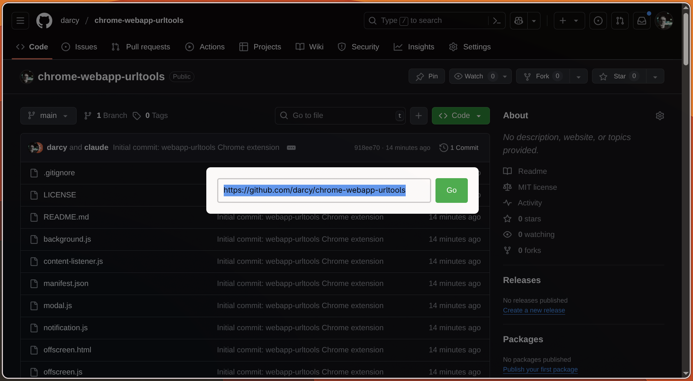

# chrome-webapp-urltools

A Chrome extension providing URL editing and copying tools optimized for web applications running in `--app` mode, particularly useful for Omarchy users.

## Screenshots

### Edit URL Modal

*The inline URL editor appears when you press `Ctrl+Shift+E`*

## Features

### 🔗 Edit Current URL (`Ctrl+Shift+E` / `Cmd+Shift+E`)
- Opens an inline modal to edit the current page URL
- Smart URL detection:
  - URLs with dots (.) are treated as web addresses
  - Plain text is treated as a search query using your default search engine
- Works in both regular browser tabs and `--app` mode windows
- Close modal with `Escape` or by clicking outside

### 📋 Rich Copy URL (`Ctrl+Shift+Y` / `Cmd+Shift+Y`)
- Copies the current URL with intelligent formatting:
  - **Plain text contexts** (terminal, text editors): Just the URL
  - **Rich text contexts** (Logseq, Obsidian, markdown editors): Formatted as `[Page Title](URL)`
- Shows a toast notification confirming the copy
- Perfect for quickly capturing references while working

## Installation

### Installing from Local Folder (Developer Mode)

1. **Download or clone this repository** to your local machine
   ```bash
   git clone https://github.com/yourusername/chrome-webapp-urltools.git
   # OR download and extract the ZIP file
   ```

2. **Open Chrome Extension Management**
   - Navigate to `chrome://extensions/` in Chrome
   - Or click the three dots menu → More Tools → Extensions

3. **Enable Developer Mode**
   - Toggle the "Developer mode" switch in the top right corner

4. **Load the Extension**
   - Click the "Load unpacked" button
   - Navigate to the `chrome-webapp-urltools` folder
   - Select the `chrome` subfolder (the folder containing `manifest.json`)
   - Click "Select Folder"

5. **Verify Installation**
   - You should see "chrome-webapp-urltools" appear in your extensions list
   - The extension is now active and ready to use!

### Updating the Extension

When you pull updates or make changes:
1. Go to `chrome://extensions/`
2. Find chrome-webapp-urltools
3. Click the refresh icon (↻) on the extension card

### Troubleshooting Installation

- **"Manifest file is missing or unreadable"**: Make sure you selected the `chrome` subfolder containing `manifest.json`
- **Extension not working in app mode**: Reload the app window after installing
- **Keyboard shortcuts not working**: Check for conflicts at `chrome://extensions/shortcuts`

## Keyboard Shortcuts

| Action | Windows/Linux | Mac |
|--------|---------------|-----|
| Edit URL | `Ctrl+Shift+E` | `Cmd+Shift+E` |
| Copy URL | `Ctrl+Shift+Y` | `Cmd+Shift+Y` |

### Customizing Shortcuts

You can customize keyboard shortcuts at `chrome://extensions/shortcuts`

**Note about Ctrl+Shift+C**: While you might prefer `Ctrl+Shift+C` for copying, this shortcut is reserved by Chrome DevTools and cannot be overridden by extensions. `Ctrl+Shift+Y` is the recommended alternative.

## Why This Extension?

This extension was created specifically to address the limitations of Chrome's `--app` mode, which is heavily used in Omarchy and other PWA-focused workflows. Standard Chrome extensions often fail to inject content scripts into app mode windows, making it difficult to add functionality to web apps running as standalone applications.

### Key Benefits for App Mode Users:
- **Works everywhere**: Unlike typical extensions, chrome-webapp-urltools uses declarative content scripts that load at document start, ensuring functionality in app mode
- **No browser chrome needed**: All features work through keyboard shortcuts and inline UI, perfect for distraction-free app windows
- **Smart clipboard handling**: Rich copy feature adapts to where you're pasting, making it seamless to capture references

## Technical Details

### Architecture
- **Manifest V3**: Built using the latest Chrome extension standards
- **Content Scripts**: Declaratively injected at document_start for maximum compatibility
- **Offscreen Documents**: Used for reliable clipboard operations
- **Fallback Chains**: Multiple injection methods ensure the extension works across all contexts

### Project Structure
```
chrome-webapp-urltools/
├── chrome/                    # Extension source files
│   ├── manifest.json         # Extension configuration
│   ├── background.js         # Service worker handling commands and messaging
│   ├── content-listener.js  # Content script loaded on all pages
│   ├── modal.js             # URL editing modal interface
│   ├── notification.js      # Toast notification system
│   ├── offscreen.js         # Clipboard handling script
│   └── offscreen.html       # Offscreen document for clipboard
├── screenshots/              # Extension screenshots
├── README.md                # This file
└── LICENSE                  # MIT License
```

## Compatibility

- Chrome/Chromium 96+ (for dynamic content scripts)
- Works in:
  - Regular browser tabs
  - Chrome `--app` mode windows
  - PWAs (Progressive Web Apps)
  - Installed web apps

## Known Limitations

1. Cannot override Chrome's built-in shortcuts (like `Ctrl+Shift+C` for DevTools)
2. Some system-level pages (chrome://, edge://) cannot be modified
3. Requires host permissions for all sites to work universally

## Contributing

This extension is open for improvements! If you encounter issues or have feature requests, please feel free to contribute.

## License

MIT License - Feel free to modify and distribute as needed.

## Acknowledgments

Built for the Omarchy community and all users who rely on Chrome's `--app` mode for their daily workflows.
